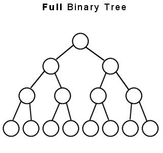
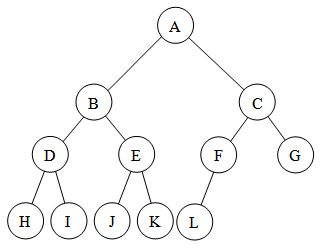
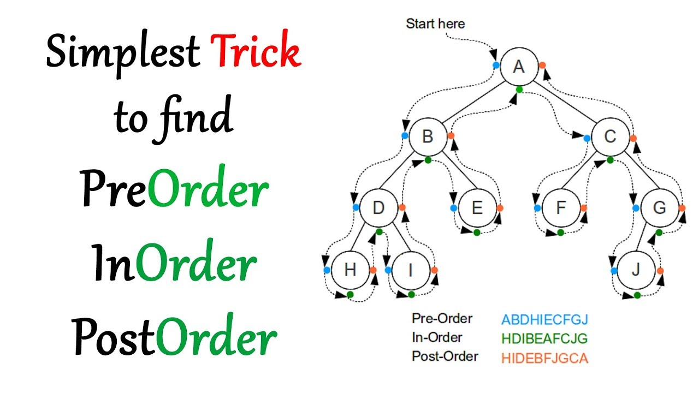
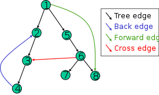

# :books: Ultimate Guide To Algorithm

All-in-one algorithms guide that you need to know as IT Tech Person.
Feel free to contribute to this project.

<br>

## Background knowledge

<br>

### 1. Big O Notation :dart:

When you study Algorithms, you will see a lot of notations like `O(n)`, `O(nlogn)` and such. No need to be lost! :) This is just a mark of how much the time/space cost will approximately take for the given algorithm.
`n` refers to the size of the input.

Here are some examples of Big O Notation:

-   **O(1)**: The cost is irrelevant of the input size `n`
-   **O(n)**: The cost is linear of the input size `n`
-   **O(nlogn)**: Oh wow, The cost increases in proportion to nlogn of the input size `n`
-   **O(n^2)**: Oh... The cost increases in proportion to n^2 of the input size `n`
-   **O(n!)**: Omg!! The cost increases in proportion to factorial of the input size `n`!


<br>
<br>

### 2. Time Complexity :timer_clock:

Time Complexity is computational complexity that describes **the amount of computer time it takes to run an algorithm**

Here are some examples of time complexity
<br>

##### Question 1

```python
nums = [1, 2, 3, 4, 5]
for n in nums:
    print(n)
```

<details>
<summary>Answer</summary>
<div markdown="1">
<b>O(N)</b>
<br>
The code runtime depends on length of nums. As the nums gets bigger, the run time only gets bigger in linear time O(N)
</div>
</details>

<br>

##### Question 2

```python
nums = [1, 2, 3, 4, 5]

for n1 in nums:
    for n2 in nums:
        print(n1, n2)
```

<details>
<summary>Answer</summary>
<div markdown="1">
<b>O(N^2)</b>
<br>
The code runtime depends on length of nums. As the nums gets bigger, the run time gets bigger by N^2 because of the nested loop
</div>
</details>
<br>

#### Amortized vs Averaged Runtime?

-   Averaged is often used when the case is random(unpredictable).
-   Amortized is often used when the case is predictable but is too good to just diminish all the runtime performance just because of some slow cases(predictable).

-   From: Amortized vs Averaged runtime https://gist.github.com/jconnolly/5acf05f279a7e9e40371

<br>
<br>

### 3. Space Complexity :floppy_disk:

Space Complexity is amount of **memory space required to run an algorithm**

Let's see some examples here too.

##### Question 1

```python
# Returns sum of the array
def get_sum(nums):
    total_sum = 0

    for n in nums:
        total_sum += n
    
    return total_sum
```

<details>
<summary>Answer</summary>
<div markdown="1">
<b>O(1)</b>
<br>
We don't need additional memory space other than the variable called <code>total_sum</code> which is constant regardless of the size of the input coming(<code>nums size</code>) 
</div>
</details>

<br>

##### Question 2

```python
# Returns 2D Array based on input
def create_matrix(n):
    matrix = []
    for i in range(n):
        row = []
        for j in range(n):
            row.append(0)
        matrix.append(row)
    return matrix 

```

<details>
<summary>Answer</summary>
<div markdown="1">
<b>O(N^2)</b>
<br>
Based on the input <code>n</code>, the code needs n^2 additional space for creating returned matrix.

</div>
</details>

<br>
<br>


### 4. Tips on Studying Algorithms
* For Data Structure Visualizations, this website might help(The method how it solves might be different from this page): https://www.cs.usfca.edu/~galles/visualization/Algorithms.html

---

<br>

## Searching Algorithms

#### Linear Search

#### Binary Search

##### Iterative

```python
def binary_search(arr, x):
    l, r = 0, len(arr)-1
    while l <= r:
        mid = (l + r) // 2
        if arr[mid] < x:
            l = mid + 1
        elif x < arr[mid]:
            r = mid - 1
        else:
            return mid
    return -1
```

-   Time Complexity: O(log(n))

-   Space Complexity: O(1)

##### Recursive

```python
# Returns index of x in arr if present, else -1
def binarySearch (arr, l, r, x):

    # Check base case
    if l > r:
        return -1

    mid = (l + r) // 2

    # If element is present at the middle itself
    if arr[mid] == x:
        return mid

    # If element is smaller than mid, then it can only
    # be present in left subarray
    elif arr[mid] > x:
        return binarySearch(arr, l, mid-1, x)

    # Else the element can only be present in right subarray
    else:
        return binarySearch(arr, mid+1, r, x)

```

-   Note that we are SEARCHING not SORTING so we don't check every element.
    --> That's why it takes O(logn)

-   when calling this function, `l` should be `0` and `r` should be `len(arr) - 1`
    like `binarySearch(arr, 0, len(arr) - 1, 15)`

-   Time Complexity: O(log(n))

-   Space Complexity: O(log(n)) --> Because of `call stack`

##### Resource

https://www.sanfoundry.com/python-program-implement-binary-search-recursion/

https://blog.finxter.com/iterative-vs-recursive-binary-search-algorithms-in-python/

#### Bubble Sort

```python
def bubbleSort(arr):
    n = len(arr)

    # Traverse through all array elements
    for i in range(n):

        # Last i elements are already in place
        for j in range(0, n-i-1):

            # traverse the array from 0 to n-i-1
            # Swap if the element found is greater
            # than the next element
            if arr[j] > arr[j+1] :
                arr[j], arr[j+1] = arr[j+1], arr[j]

# Driver code to test above
arr = [64, 34, 25, 12, 22, 11, 90]

bubbleSort(arr)
```

-   Careful with the range of `j` cause we need to use `j + 1` as well.

-   Time Complexity: O(n^2)
-   Space Compexity: O(1)
-   Sorting in place: Yes

#### Selection Sort

The Selection sort algorithm is based on the idea of finding the minimum or maximum element in an unsorted array and then putting it in its correct position in a sorted array.

-   Swapping is involved unlike insertion sorting

-   Here we are not looking for the perfect position for the element we pick(insertion sorting), we are looking for minimum, maximum value candidate to be changed.

```python
# Traverse through all array elements
for i in range(len(A)):

    # Find the minimum element in remaining
    # unsorted array
    min_idx = i
    for j in range(i+1, len(A)):
        if A[min_idx] > A[j]:
            min_idx = j

    # Swap the found minimum element with
    # the first element
    A[i], A[min_idx] = A[min_idx], A[i]
```

-   Time Complexity: O(n^2)
-   Space Complexity: O(1)
-   In place: Yes

#### Insertion Sort

-   Inserting to the right place from the front of the array.

```python
# Traverse through 1 to len(arr)
def insertion_sort(arr):
    for i in range(1, len(arr)):

        key = arr[i]

        # Move elements of arr[0..i-1], that are
        # greater than key, to one position ahead
        # of their current position
        for j in range(i - 1, -1, -1): # j: i-1 ~~ 0
            if arr[j] <= key:  # Finally found the first arr[j] that should be located on the left side of the key
                break
            arr[j + 1] = arr[j]
        arr[j + 1] = key
```

-   When Adding the key to the right place

| index |       j       |    j'(= j + 1)     | j' + 1 |
| :---: | :-----------: | :----------------: | :----: |
| Value |       A       |         B          |   B    |
|       |       ^       | Put the `key` here |        |
|       | current point |                    |        |

-   Time Complexity: O(n^2)
-   Space Complexity: O(1)
-   Sorting in place: Yes

#### Quick Sort

When thinking of Quick Sorting, think of the sorting version of Binary Search. Instead of searching the middle elements of the array like when doing Binary Search,
We are placing the pivot value in the right place (Depends on how you choose the pivot tho). and You keep doing it until every element is sorted.
Also, note that left and right side of the pivot doesn't have to be sorted in order. As long as the left side of the pivot is smaller than the pivot and the right side of the pivot is bigger
than the pivot, it's all good.

Usually, you make `quicksort()` funciton and another function called `partition()`

Here's a Python implementation (Using last element as a pivot)

```python
# To think easier about this algorithm: Note that the leftmost big element and the leftmost small element right after the boundary of big number will always be swapped.
# 2 7 8 8 5 3 2 2 4
#   ^|- - -|^
#   f       l


def partition(xs, start, end):
    follower = leader = start
    while leader < end: # no need to see more when it reaches the pivot element.This
        if xs[leader] <= xs[end]: # Comparing each element with pivot(xs[end]) --> the follower will always get stuck in the big element(if there's any bigger element than pivot in the array)
                                                                            # When it reaches the very first big element, the follower will get stuck, until then, follower and leader increases together.
                                                                            # Can add `if follower == leader, skip to next one together` if this confuses you.
            xs[follower], xs[leader] = xs[leader], xs[follower]
            follower += 1
        leader += 1 # leader always increases regardless of the follower
    xs[follower], xs[end] = xs[end], xs[follower] # Place the pivot in the right place
    return follower # because of the last follower+=1, it actually returns the +1 index of the last follower --> perfect place for pivot.

def _quicksort(xs, start, end):
    if start >= end:
        return
    p = partition(xs, start, end) # 1. sort the right, left part of array with the last pivot and 2. returns the index of that pivot.
    _quicksort(xs, start, p-1)
    _quicksort(xs, p+1, end)

def quicksort(xs):
    _quicksort(xs, 0, len(xs)-1)
```

Here's another implementation (Using last element as a pivot)

```python

# Python program for Quicksort
# This function takes last element as pivot, places
# the pivot element at its correct position in sorted
# array, and places all smaller (smaller than pivot)
# to left of pivot and all greater elements to right
# of pivot
def partition(arr, low, high):
	i = low - 1		 # index of smaller element
	pivot = arr[high]	 # pivot

	for j in range(low, high):
		# If current element is smaller than or
		# equal to pivot
		if arr[j] <= pivot:
			# increment index of smaller element
			i += 1
			arr[i], arr[j] = arr[j], arr[i]
	arr[i + 1], arr[high] = arr[high], arr[i + 1]
	return i + 1

# The main function that implements QuickSort
# arr[] --> Array to be sorted,
# low --> Starting index,
# high --> Ending index

# Function to do Quick sort
def quickSort(arr, low, high):
	if low < high:

		# pi is partitioning index, arr[p] is now
		# at right place
		pi = partition(arr, low, high)

		# Separately sort elements before
		# partition and after partition
		quickSort(arr, low, pi - 1)
		quickSort(arr, pi + 1, high)

# Driver code to test above
arr = [10, 7, 8, 9, 1, 5]
n = len(arr)
quickSort(arr, 0, n - 1)
print ("Sorted array is:")
for i in range(n):
	print ("%d" %arr[i]),
```

Resource

Great explanation for quick sorting(last element pivot)--> https://www.codementor.io/@garethdwyer/quicksort-tutorial-python-implementation-with-line-by-line-explanation-p9h7jd3r6

#### Merge Sort

#### Heap Sort

#### Counting Sort

#### Radix Sort

#### BucketSort

> Sort a large set of floating point numbers which are in range from 0.0 to 1.0 and are uniformly distributed across the range. How do we sort the numbers efficiently?

The process of bucket sort can be understood as scatter-gather approach. The elements are first scattered into buckets then the elements of buckets are sorted. Finally, the elements are gathered in order.
It is commonly used when elements are uniformly distributed.

You uniformly distribute all the elements and the best case is having every bucket for each element. in that case, we won't have to really sort the bucket.
and we The last step of bucket sort, which is concatenating all the sorted objects in each buckets, requires {\displaystyle O(k)} O(k) time

> When the range is not limited for the input values, this sorting algorithm shouldn't be used.
>
> When thinking of making buckets for this case we never know
> the range of the integers that will be input. And even if we try to think all the cases, we can't make every buckets beforehand until infinite.

Conventionally, insertion sort would be used for sorting buckets, but other algorithm could be used as well

Bucket sort performs at its worst, O(n^2), when all elements at allocated to the same bucket

-   Time Complexity: Best--> O(n + k) / Worst --> O(n^2)
-   Space Complexity:
-   Bucket sort is not a comparison sorting algorithm!

References

https://en.wikipedia.org/wiki/Bucket_sort#Average-case_analysis

https://stackoverflow.com/questions/54808131/how-is-the-time-complexity-of-bucket-sort-onk-if-it-uses-insertion-sort-to-so

https://stackoverflow.com/questions/31633391/when-should-i-choose-bucket-sort-over-other-sorting-algorithms

#### Tim Sort

## LinkedList

> Python does not have linked lists in its standard library. We implement the concept of linked lists using the concept of nodes

> Side Note: It’s weird to talk about linked lists in python because this data structure is too low level to be useful in python programs. So don’t blame me if you don’t see the point of coding all this in Python. After all, there’s not much point in using linked list in Python besides its educational value and usefulness in coding interviews. In other languages like C and C++, where linked lists are actually crucial to any programs you’re implementing.

### Singly LinkedList

-   Note that the SinglyLinkedList class only remembers the head `Node` of the linkedlist (The `Node` class remembers its next node).

Advantages

-   A linked list saves memory. It only allocates the memory required for values to be stored. In arrays, you have to set an array size before filling it with values, which can potentially waste memory.
-   Linked list nodes can live anywhere in the memory. Whereas an array requires a sequence of memory to be initiated, as long as the references are updated, each linked list node can be flexibly moved to a different address.

Disadvantages

-   Linear look up time. When looking for a value in a linked list, you have to start from the beginning of chain, and check one element at a time for a value you’re looking for. If the linked list is n elements long, this can take up to n time. On the contrary many languages allow constant lookups in arrays.
    Like for an array, if you do `a[100]` then the result pops out in constant time. However if you want to get the third item from the linked list, you would have to traverse through the linkedlist(until the 100th).

#### Creation

```python
class Node:
    def __init__(self, dataval=None):
        self.dataval = dataval
        self.nextval = None

class SLinkedList:
    def __init__(self):
        self.headval = None

list1 = SLinkedList()
list1.headval = Node("Mon")
e2 = Node("Tue")
e3 = Node("Wed")
# Link first Node to second node
list1.headval.nextval = e2
# Link second Node to third node
e2.nextval = e3
```

#### Traversing

```python
class Node:
    def __init__(self, dataval=None):
        self.dataval = dataval
        self.nextval = None

class SLinkedList:
    def __init__(self):
        self.headval = None

    def listprint(self):
        printval = self.headval
        while printval is not None:
            print (printval.dataval)
            printval = printval.nextval

list = SLinkedList()
list.headval = Node("Mon")
e2 = Node("Tue")
e3 = Node("Wed")

# Link first Node to second node
list.headval.nextval = e2

# Link second Node to third node
e2.nextval = e3

list.listprint()
```

Time Complexity: O(N)

#### Inserting an element

##### Inserting at the beginning

```python
class Node:
    def __init__(self, dataval=None):
        self.dataval = dataval
        self.nextval = None

class SLinkedList:
    def __init__(self):
        self.headval = None
    def AtBegining(self,newdata):
            NewNode = Node(newdata)

            # Update the new nodes next val to existing node
            NewNode.nextval = self.headval
            self.headval = NewNode
```

Time Complexity: O(1)

##### Inserting in between two Nodes

```python
class Node:
    def __init__(self, dataval=None):
        self.dataval = dataval
        self.nextval = None

class SLinkedList:
    def __init__(self):
        self.headval = None

# Function to add node
    def Inbetween(self,middle_node,newdata):
        if middle_node is None:
            print("The mentioned node is absent")
            return

        NewNode = Node(newdata)
        NewNode.nextval = middle_node.nextval
        middle_node.nextval = NewNode
```

##### Inserting at the end

```python
class Node:
    def __init__(self, data=None):
        self.data = data
        self.next = None

class SLinkedList:
    def __init__(self):
        self.head_node = None

# Function to add newnode
    def AtEnd(self, newdata):
        new_node = Node(newdata)

        if not self.head_node: # if head_node doesn't exist.
            self.head_node = new_node
            return

        last_element = self.head_node
        while last_element.next:
            last_element = last_element.nextval
        last_element.next = new_node
```

Time Compleixty: O(N)

##### Removing an item

Input: the value you want to delete.

```python
class Node:
    def __init__(self, data=None):
        self.data = data
        self.next = None

class SLinkedList:
    def __init__(self):
        self.head = None

    def remove_Node(self, value):
        prev = None
        curr = self.head
        while curr:
            if curr.data == value:
                if prev: # General cases
                    prev.next(curr.next)
                else: # Edge case: When prev is None and curr is the head
                    self.head = curr.next
                return
            prev = curr
            curr = curr.next
```

Time Complexity: O(N)

### Doubly LinkedList

Pros

-   Efficient iteration (especially when iterating reverse)
-   Delete operation is more efficient than Singly LinkedList

Cons

-   More memory for storage (.prev pointer)
-   Relatively complex implementation than Singly LinkedList(coding)

#### Operations

##### Creation

#### Example of Using Doubly LinkedList

1. LRU Cache

-   LRU Cache uses `HashMap` and `Doubly LinkedList` to make Adding and deleting _O(1)_ operation.
    --> Because of _O(1)_ Time Complexity, we need to use use both of those data structure!

-   Also there's a

Link

https://www.interviewcake.com/concept/java/lru-cache

https://leetcode.com/problems/lru-cache

### When to use Singly LinkedList and Doubly LinkedList?

Resource  
About LinkedList: https://medium.com/@kojinoshiba/data-structures-in-python-series-1-linked-lists-d9f848537b4d

Singly LinkedList vs Doubly LinkedList: https://stackoverflow.com/questions/10708790/microsoft-asks-singly-list-or-doubly-list-what-are-the-pros-and-cons-of-using

---

## Stack

-   A stack is a data structure that stores items in an Last-In/First-Out manner. This is frequently referred to as LIFO.

-   For `stack`, we have
    > -   \*`push()`: put new element into stack
    > -   \*`pop()`: pop the top element
    > -   `peek()`: see what's on the top(but not removing)
    > -   `empty()`: boolean, `true` if empty

#### Implementation

For Python, we have 3 ways of implementing `Stack`.

1.Using `list` Built-in

-   Using `append()` for `push()` and `pop()` for `pop()`.

-   `push()` and `pop()` takes Amortized _O(1)_ time complexity in list.

-   When searching element from the stack, it has a benefit of taking _O(1)_ time complexity.

    2.Using `collections.deque`

-   Using `append()` for `push()` and `pop()` for `pop()`.

-   The deque class implements a double-ended queue which supports addition and removal of elements from either end in _O(1)_ time (non-amortized).

-   Because deques support adding and removing elements from both ends equally well, they can serve both as `queue`s and as `stack`s.

-   Python’s `deque` objects are implemented as `doubly-linked lists` which gives them proper and consistent performance insertion and deletion of elements, but poor _O(n)_ performance as they randomly access elements in the middle of the stack.

    3.Using `queue.LifoQueue`

#### Resource

https://realpython.com/how-to-implement-python-stack/

https://www.edureka.co/blog/stack-in-python/

https://www.geeksforgeeks.org/stack-in-python/

## Queue

> -   enqueue(): Adds an item to the queue
> -   dequeue(): Removes an item from the queue
> -   front(): Get the front item
> -   end(): Get the last item

### Implementation

There are also 3 ways to implement `Queue` on Python.

1. Using `list`

-   Instead of enqueue() and dequeue(), append() and pop() function is used.

-   However, lists are quite slow for this purpose because inserting or deleting an element at the beginning requires shifting all of the other elements by one, requiring O(n) time.

2. Using `collections,deque`

-   Deque is preferred over list in the cases where we need quicker append and pop operations from both the ends of container, as deque provides an O(1) time complexity for append and pop operations as compared to list which provides O(n) time complexity. Instead of `enqueue` and `deque`, `append()` and `popleft()` functions are used.

3. Using `queue.Queue`

---

## Trees

### Overall Concepts

#### Kinds of Trees

-   Full Binary Tree: A full binary tree (sometimes proper binary tree or 2-tree) is a tree in which every node other than the leaves has two children.



-   Complete Binary Tree:
    A complete binary tree is a binary tree in which every level, except possibly the last, is completely filled, and all nodes are as far left as possible.

dfs

#### Understanding the array-based tree index formula

-   IF THE ARRAY INDEX IS STARTING FROM INDEX 0

    > 1. left_child_i = parent_i \* 2 + 1
    > 2. right_child_i = parent_i \* 2 + 2
    > 3. parent_i = floor((child_i - 1) / 2) --> rounding down at the end.
    >
    > ```
    >
    >     0    T = 1
    >    / \
    >   1    2   T = 2
    >  / \  / \
    > 3   4 5  6  T = 3
    >
    > ```
    >
    > **proof for 1. 2.)**  
    > When T is the tier of the tree, 2^T - 1 is the index(value) of the first node of the next level(T + 1)  
    > j is the index starting from the beginning of the Tier's index. (In the above tree, 5's j is 2)
    >
    > (parent_node_index) i = 2^T - 1 + j  
    > (left_child_node_index) i' = 2^(T+1) - 1 + 2j'
    >
    > 2j' --> When you take a look at the tree, for each node for i~j, i'~j' get 2 for each. So 2j' is correct.
    >
    > Therefore, i' = 2i + 1 (for the left child node)

-   IF ARRAY IS STARTING FROM INDEX 1
    > 1. left_child_i = parent_i \* 2
    > 2. right_child_i = parent_i \* 2 + 1
    > 3. parent_i = floor(child_i / 2) --> rounding down at the end.

#### DFS

##### DFS Traversals



-   Pre-Order Traversal  
    Parent -> Left -> Right

        ```python
        # A function to do preorder tree traversal
        def printPreorder(root):

            if root:

                # First print the data of node
                print(root.val),

                # Then recur on left child
                printPreorder(root.left)

                # Finally recur on right child
                printPreorder(root.right)
        ```

        * Used when duplicating a binary tree.

        * Used for generating prefix representation
        (Polish Notation)

-   In-Order Traversal  
    Left -> Parent -> Right

        ```python
        # A function to do inorder tree traversal
        def printInorder(root):

            if root:

                # First recur on left child
                printInorder(root.left)

                # then print the data of node
                print(root.val),

                # now recur on right child
                printInorder(root.right)
        ```

        * For BST, `In-Order` Traversal prints items in sorted way (will traverse nodes in non-decreasing order)

-   Post-Order Traversal  
    Left -> Right -> Parent

    ````python # A function to do postorder tree traversal
    def printPostorder(root):

            if root:

                # First recur on left child
                printPostorder(root.left)

                # the recur on right child
                printPostorder(root.right)

                # now print the data of node
                print(root.val)
        ```

        * Used for deleting nodes (it's easier to deelte leaf nodes and doing this in post-order)

        * For generating postfix representation

    Reference
    Photo: https://www.google.com/url?sa=i&url=https%3A%2F%2Fwww.youtube.com%2Fwatch%3Fv%3DWLvU5EQVZqY&psig=AOvVaw2XG_qR2e1xrZ-Bm1wtmVO8&ust=1586093266550000&source=images&cd=vfe&ved=0CAIQjRxqFwoTCOD_qoLwzugCFQAAAAAdAAAAABAD
    ````

#### BFS vs DFS

BFS

-   If solution is not far from the root of the free

-   If the tree is deep and solutions are rare (DFS will take too long)

-   Often used for shortest path from the starting vertex to a given vertex

DFS

-   If tree is too wide (BFS might need too much memory)

-   Solutions are frequent but located deep in the tree

-   Often used in simulations of games (Chess, Tic-tac-toe etc...)

-   Used when you want to exhaust all possibilities, and check which one is the best/count the number of all possible ways.

For Both

-   when you just want to check connectedness between two nodes on a given graph. (Or more generally, whether you could reach a given state to another.)

Reference

https://stackoverflow.com/questions/3332947/when-is-it-practical-to-use-depth-first-search-dfs-vs-breadth-first-search-bf

https://www.quora.com/When-should-we-use-BFS-instead-of-DFS-and-vice-versa

---

### BST(Binary Search Tree)

---

### AVL Tree

### Maipulating Trees

#### Copying a tree

Recursive

```java
public TreeNode cloneTree(TreeNode root) {
        if (root == null) return null;
        TreeNode newNode = new TreeNode(root.val);
        newNode.left = cloneTree(root.left);
        newNode.right = cloneTree(root.right);
        return newNode;
}
```

Iterative

---

### Binary Heaps

#### Building heaps

a. Heapify from the lowest-level to the root node.

```python
# Build a maxheap.
    for i in range(n, -1, -1): #--> n could be changed to ((n - 1) - 1) // 2 for the optimization cause we already know the leaves node don't have any children.
        heapify(arr, n, i)
```

-   Note: Sift-Down is way more efficient than Sift-Up here. Sift-Down takes O(n) and Sift-Up takes O(nlog(n)) for building a heap. (When talking about Sift-Down and Sift-Up, we are talking about how `heapify()` works inside. So to speak, if `heapify(arr, n, i)` calls `heapify(arr, n, child)`, then it's Sift Down and if it calls `heapify(arr, n, parent)`, then it's sift up method)

Time Complexity: O(n) --> Check out the link

#### Heapify

1. Max Heapify

Process
a. compare the i node with its children a  
b. put the largest one on the top(swap with i node value.)  
-b-1. Call Max Heapify for the subtree(Heapify the subtrees of the largest one (cause the smaller element that swapped could violate the property of max heaps in the subtree))

```python
# To heapify subtree rooted at index i.
# n is size of heap
def heapify(arr, n, i):
    # largest index is needed for keeping track of where it had the largest value (because we need to heapify that place after)
    largest = i # Initialize largest as root
    l = 2 * i + 1     # left = 2*i + 1
    r = 2 * i + 2     # right = 2*i + 2

    # Compare with l and r to find the biggest candidate for the root node.
    # Eventually only the biggest node and the i node get swapped (only the value gets swapped.)

    # See if left child of root exists and is
    # greater than root
    if l < n and arr[i] < arr[l]:
        largest = l

    # See if right child of root exists and is
    # greater than root
    if r < n and arr[largest] < arr[r]:
        largest = r

    # Change root, if needed
    if largest != i:
        arr[i],arr[largest] = arr[largest],arr[i] # swap

        # Heapify the child --> largest index is the child (only the value has changed) --> We are sifting down now.
        heapify(arr, n, largest)

```

Time Complexity: O(log(n))

#### Inserting element

Process
a. Add the new element on the lowest-level, left-most position.  
b. Sift up the new element.

This bottom-up approach is also called `Sift up`

Time Complexity: Worst --> O(log(n)), Average --> O(1)
Space Complexity: O(1)

#### Extract element

Process  
a. Remove the root node (We usually only want the root node cause we are only interested in Max and Min value)  
b. Replace the root node place with the lowest-level, right-most children.
c. Sift down the root node.

#### Delete element

#### Heapsorting

```python
# The main function to sort an array of given size
def heapSort(arr):
    n = len(arr)

    # Build a maxheap.
    for i in range(n, -1, -1): #--> n could be ((n - 1) - 1) // 2 for the optimization cause we already the leaves node don't have any children.
        heapify(arr, n, i)

    # One by one extract elements
    for i in range(n-1, 0, -1):
        arr[i], arr[0] = arr[0], arr[i] # swap
        heapify(arr, i, 0)
```

#### Why do we use Array representation over Tree representation for Heaps?

```
The tree uses more time and memory. The complexities are the same, but the constant factors are different.

The pointers of the tree use a lot of memory, compared to the array-based heap, where you barely need any additional space but the one taken by the values themselves. And manipulating these pointers takes time too. Allocating and deallocating nodes might take some time and space also...

In addition, there's no guarantee that the nodes of the tree will be together in memory. If any of the two alternatives takes benefit of the cache, it is the array-based heap.
```

#### Priority Queue and the Binary Heap

When using priority queue, if we use binary heap, it is much faster than using the normal array or LinkedList cause it only takes O(n) to add. However, Like sorting, it takes O(nlogn).

##### Priority queue

-   Implementations

    1. Array implementation

    2. LinkedList implementation

        - peek(): O(1)
        - enqueue(): O(n)
        - dequeue(): O(1)

    3. Binary Heap implementation

        - peek(): O(1)
        - enqueue(): O(LogN)
        - dequeue(): O(LogN)

    4. BST implementation
        - peek(): O(1)
        - enqueue(): O(LogN)
        - dequeue(): O(LogN)

-   Binary Heap VS BST which one's better for pq?

    -   Since Binary Heap is implemented using arrays, there is always better locality of reference and operations are more cache friendly.

    -   Binary Heap doesn’t require extra space for pointers.

    -   Although operations are of same time complexity, constants in Binary Search Tree are higher

    -   Binary Heap is easier to implement.

    -   There are variations of Binary Heap like Fibonacci Heap that can support insert and decrease-key in Θ(1) time

-   Still, BST could be better sometimes

    -   Searching an element in self-balancing BST is O(Logn) which is O(n) in Binary Heap.

    -   We can print all elements of BST in sorted order in O(n) time, but Binary Heap requires O(nLogn) time.

    -   `Floor and ceil` can be found in O(Logn) time.

    -   K’th largest/smallest element be found in O(Logn) time by augmenting tree with an additional field.

Reference

https://www.geeksforgeeks.org/why-is-binary-heap-preferred-over-bst-for-priority-queue/

###### Resources

Basics about Heaps: https://medium.com/basecs/learning-to-love-heaps-cef2b273a238

Time Complexity of building a heap:

-   https://www.growingwiththeweb.com/data-structures/binary-heap/build-heap-proof/ --> In this link, `h(height)` starts from the leaf node(leaves nodes `h` is 0).
-   https://stackoverflow.com/questions/9755721/how-can-building-a-heap-be-on-time-complexity

Sift down vs Sift up: https://www.reddit.com/r/algorithms/comments/8n543e/what_is_the_difference_between_maxheapify_and/

HeapSort: https://medium.com/basecs/heapify-all-the-things-with-heap-sort-55ee1c93af82 --> There are things that's quite not right so check the comments!

HeapSort: https://www.geeksforgeeks.org/heap-sort/

Array vs Tree for Heaps: https://stackoverflow.com/questions/14719007/why-is-a-binary-heap-better-as-an-array-than-a-tree

Array-based tree index formula Explanation: https://cs.stackexchange.com/review/suggested-edits/66932

About Priority Queue: https://www.geeksforgeeks.org/priority-queue-set-1-introduction/

Priorty Queue and Binary Heap: https://runestone.academy/runestone/books/published/pythonds/Trees/PriorityQueueswithBinaryHeaps.html

### Fibonacci Heap

-   Time Complexity:

Extract min: O(LogN)
Decreasing key: O(1) --> Amortized

## Graphs

### Degrees in Graphs

1. Degree

    - The degree of a vertex of a graph is the number of edges that are incident to the vertex,

    - In multigraph,loops are counted twice

2. Indegree (in DAG)

    - Indegree of vertex V is the number of edges which are coming into the vertex V.

3. Outdegree (in DAG)
    - Outdegree of vertex V is the number of edges which are going out from the vertex V.

### Graph and its representations

1. Edge lists

    ```
    [ [0,1], [0,6], [0,8], [1,4], [1,6], [1,9], [2,4], [2,6], [3,4], [3,5],
    [3,8], [4,5], [4,9], [7,8], [7,9] ]
    ```

    - To represent an edge, we just have an array of two vertex numbers, or an array of objects containing the vertex numbers of the vertices that the edges are incident on

    - For weights, add either a third element to the array or more information to the object.

    - Simple but needs linear search for checking whether the graph contains a particular edge

2. Adjacency matrices

    ```
    [ [0, 1, 0, 0, 0, 0, 1, 0, 1, 0],
    [1, 0, 0, 0, 1, 0, 1, 0, 0, 1],
    [0, 0, 0, 0, 1, 0, 1, 0, 0, 0],
    [0, 0, 0, 0, 1, 1, 0, 0, 1, 0],
    [0, 1, 1, 1, 0, 1, 0, 0, 0, 1],
    [0, 0, 0, 1, 1, 0, 0, 0, 0, 0],
    [1, 1, 1, 0, 0, 0, 0, 0, 0, 0],
    [0, 0, 0, 0, 0, 0, 0, 0, 1, 1],
    [1, 0, 0, 1, 0, 0, 0, 1, 0, 0],
    [0, 1, 0, 0, 1, 0, 0, 1, 0, 0] ]
    ```

    - For a graph with |V|∣V∣vertical bar, V, vertical bar vertices, an adjacency matrix is a |V| \times |V|∣V∣×∣V∣vertical bar, V, vertical bar, times, vertical bar, V, vertical bar matrix of 0s and 1s, where the entry in row iii and column jjj is 1 if and only if the edge (i,j)(i,j)left parenthesis, i, comma, j, right parenthesis is in the graph

    - Upside

        1. we can find out whether an edge is present in constant time, by just looking up the corresponding entry in the matrix

    - Downside

        1. Takes V^2 Space even if the graph is sparse

        2. if you want to find out which vertices are adjacent to a given vertex i, you have to look at all ∣V∣ enties in row i even if only a small number of vertices are adjacent to vertex i

    - For an undirected graph, the adjacency matrix is symmetric.

3. Adjacency lists

    ```
    [ [1, 6, 8],
    [0, 4, 6, 9],
    [4, 6],
    [4, 5, 8],
    [1, 2, 3, 5, 9],
    [3, 4],
    [0, 1, 2],
    [8, 9],
    [0, 3, 7],
    [1, 4, 7] ]
    ```

    - Representing a graph with adjacency lists combines adjacency matrices with edge lists

    - Vertex numbers in an adjacency list are not required to appear in any particular order, though it is often convenient to list them in increasing order

Reference
https://www.khanacademy.org/computing/computer-science/algorithms/graph-representation/a/representing-graphs

### BFS

### DFS

#### Directed Graph

One thing we have to think carefully is that unlike `tree` data structure, Graphs can be visited more than once. So we have to be aware of that.

-   We want to make sure that we visit all the vertices!

Below code works for when every node is quite strongly connected and assuming there will be no left out ones.

```python
# V: A list of vertices/ adj: adjacency list / s: vertex we are visiting
parent = {s: None}
def dfs_visit(V, adj, s):
    for v in adj[s]:
        if v not in parent:
            parent[v] = s
            dfs_visit(V, adj, v)
```

But what if some graphs are not strongly connected and there are more than one cluster? For those cases we can use the above function recursively like below!
And this methodology should be used usually for Graph DFS!

```python
def dfs(V, adj):
    parent = {}
    for s in V:
        if s not in parent: # This means we didn't visit s
            parent[s] = None
            dfs_visit(v, adj, s) # So let's visit s!
```

Time Complexity: O(V + E) --> Linear Time

-   The above code will make directed graph get visited once and undirected graph get visited twice(one from each side)

### Edge Classification



-   Tree edge: the edge that leads us to new edge (it forms a tree in the end that's why it's called that way)

-   Forward edge: takes node to descendant in the tree

-   Backward edge: takes node to ancestor in the tree

-   Cross edge: takes sibling node to sibling node in the tree

To detect Forward edge, Cross edge --> use counter for it just like the level!

To detect backward edge: use stack to see if the current node

You can't have forward edges and cross edges in undirected graphs (Still can have tree edges and Backward edges)

### Cycle Detection

-   Graph has a cycle <==> Graph has a backward edge

#### Graph Cycle Detection Algorithms

### Topological Sort

> One good example of using Topological Sort is 'Job Scheduling'

Givven directed acyclic graph (DAG), order vertices so that all edges point from lower order to higher order.

-   Topological Sorting result can be more than one since the requirement of it is to only have forward edges left to right in the printed result.

#### Using DFS with Stack

```python
#Python program to print topological sorting of a DAG
from collections import defaultdict

#Class to represent a graph
class Graph:
	def __init__(self,vertices):
		self.graph = defaultdict(list) #dictionary containing adjacency List
		self.V = vertices #No. of vertices

	# function to add an edge to graph
	def addEdge(self,u,v):
		self.graph[u].append(v)

	# A recursive function used by topologicalSort
	def topologicalSortUtil(self,v,visited,stack):

		# Mark the current node as visited.
		visited[v] = True

		# Recur for all the vertices adjacent to this vertex
		for i in self.graph[v]:
			if visited[i] == False:
				self.topologicalSortUtil(i,visited,stack)

		# Push current vertex to stack which stores result
		stack.insert(0,v)

	# The function to do Topological Sort. It uses recursive
	# topologicalSortUtil()
	def topologicalSort(self):
		# Mark all the vertices as not visited
		visited = [False]*self.V
		stack =[]

		# Call the recursive helper function to store Topological
		# Sort starting from all vertices one by one
		for i in range(self.V):
			if visited[i] == False:
				self.topologicalSortUtil(i,visited,stack)

		# Print contents of the stack
		print stack

g= Graph(6)
g.addEdge(5, 2);
g.addEdge(5, 0);
g.addEdge(4, 0);
g.addEdge(4, 1);
g.addEdge(2, 3);
g.addEdge(3, 1);

print "Following is a Topological Sort of the given graph"
g.topologicalSort()
#This code is from geeksforgeeks

# Following is a Topological Sort of the given graph
# 5 4 2 3 1 0

```

-   Time Complexity : O(V + E)

#### Kahn's Algorithm (BFS method)

-   Time Complexity : O (V + E)

Resource

MIT Course-DFS, Topological sort, Edge classification, Cycle detection
https://www.youtube.com/watch?v=AfSk24UTFS8

DFS and Topological sorting medium  
https://medium.com/@yasufumy/algorithm-depth-first-search-76928c065692

Topoloical sort
https://www.geeksforgeeks.org/topological-sorting/

Kahn's Algorithm
https://www.educative.io/edpresso/what-is-topological-sort

https://www.geeksforgeeks.org/topological-sorting-indegree-based-solution/

### Edge Relaxation

-   What's Edge Relaxation?

    > The edge relaxation is the operation to calculate the reaching cost to the vertex lower. The algorithms for the shortest paths problem solve the problem by repeatedly using the edge relaxation

-   Reference

    https://towardsdatascience.com/algorithm-shortest-paths-1d8fa3f50769

### Dijkstra Algorithm

When the edge is not weighted(every edge's weight is 1), we should consider using BFS. Otherwise, Use Dijkstra Algorithm.

-   Dijkstra Algorithm is a greedy Algorithm since it reaches out the nearest node first. (The algorithm won't fail even without checking the shortest one first but it will take much more time. --> Then there's no point of using this algorithm so this should be a greedy algorithm)

-   Dijkstra can be implement in many ways but the efficient and most common one is implemented with `Priority queue(Min-heap based)`

-   Algorithm

    1. Create a Min Heap of size V where V is the number of vertices in the given graph. Every node of min heap contains vertex number and distance value of the vertex.

    2. Initialize Min Heap with source vertex as root (the distance value assigned to source vertex is 0). The distance value assigned to all other vertices is INF (infinite).

    3. While Min Heap is not empty, do following

        …..a) Extract the vertex with **minimum distance value** node from Min Heap. Let the extracted vertex be u.

        …..b) For every adjacent vertex `v` of `u`, check if `v` is in Min Heap. If v is in Min Heap(Means it hasn't been visited yet) and existing distance value of `v` is more than (`weight` of u-v edge + `distance` value of u), then update the distance value of v.

-   Implementation(Python)

```python
# A Python program for Dijkstra's shortest
# path algorithm for adjacency
# list representation of graph

from collections import defaultdict
import sys

class Heap():

	def __init__(self):
		self.array = []
		self.size = 0
		self.pos = []

	def newMinHeapNode(self, v, dist):
		minHeapNode = [v, dist]
		return minHeapNode

	# A utility function to swap two nodes
	# of min heap. Needed for min heapify
	def swapMinHeapNode(self,a, b):
		t = self.array[a]
		self.array[a] = self.array[b]
		self.array[b] = t

	# A standard function to heapify at given idx
	# This function also updates position of nodes
	# when they are swapped.Position is needed
	# for decreaseKey()
	def minHeapify(self, idx):
		smallest = idx
		left = 2*idx + 1
		right = 2*idx + 2

		if left < self.size and self.array[left][1] \
								< self.array[smallest][1]:
			smallest = left

		if right < self.size and self.array[right][1]\
								< self.array[smallest][1]:
			smallest = right

		# The nodes to be swapped in min
		# heap if idx is not smallest
		if smallest != idx:

			# Swap positions
			self.pos[ self.array[smallest][0] ] = idx
			self.pos[ self.array[idx][0] ] = smallest

			# Swap nodes
			self.swapMinHeapNode(smallest, idx)

			self.minHeapify(smallest)

	# Standard function to extract minimum
	# node from heap
	def extractMin(self):

		# Return NULL wif heap is empty
		if self.isEmpty() == True:
			return

		# Store the root node
		root = self.array[0]

		# Replace root node with last node
		lastNode = self.array[self.size - 1]
		self.array[0] = lastNode

		# Update position of last node
		self.pos[lastNode[0]] = 0
		self.pos[root[0]] = self.size - 1

		# Reduce heap size and heapify root
		self.size -= 1
		self.minHeapify(0)

		return root

	def isEmpty(self):
		return True if self.size == 0 else False

    # Used when updating the existing distance (Edge relaxation)
	def decreaseKey(self, v, dist):

		# Get the index of v in heap array

		i = self.pos[v]

		# Get the node and update its dist value
		self.array[i][1] = dist

		# Travel up while the complete tree is
		# not hepified. This is a O(Logn) loop
		while i > 0 and self.array[i][1] < self.array[(i - 1) / 2][1]:

			# Swap this node with its parent
			self.pos[ self.array[i][0] ] = (i-1)/2
			self.pos[ self.array[(i-1)/2][0] ] = i
			self.swapMinHeapNode(i, (i - 1)/2 )

			# move to parent index
			i = (i - 1) / 2;

	# A utility function to check if a given
	# vertex 'v' is in min heap or not
	def isInMinHeap(self, v):

		if self.pos[v] < self.size:
			return True
		return False


def printArr(dist, n):
	print "Vertex\tDistance from source"
	for i in range(n):
		print "%d\t\t%d" % (i,dist[i])


class Graph():

	def __init__(self, V):
		self.V = V
		self.graph = defaultdict(list)

	# Adds an edge to an undirected graph
	def addEdge(self, src, dest, weight):

		# Add an edge from src to dest. A new node
		# is added to the adjacency list of src. The
		# node is added at the beginning. The first
		# element of the node has the destination
		# and the second elements has the weight
		newNode = [dest, weight]
		self.graph[src].insert(0, newNode)

		# Since graph is undirected, add an edge
		# from dest to src also
		newNode = [src, weight]
		self.graph[dest].insert(0, newNode)

	# The main function that calulates distances
	# of shortest paths from src to all vertices.
	# It is a O(ELogV) function
	def dijkstra(self, src):

		V = self.V # Get the number of vertices in graph
		dist = [] # dist values used to pick minimum
					# weight edge in cut

		# minHeap represents set E
		minHeap = Heap()

		# Initialize min heap with all vertices.
		# dist value of all vertices
		for v in range(V):
			dist.append(sys.maxint)
			minHeap.array.append( minHeap.newMinHeapNode(v, dist[v]) )
			minHeap.pos.append(v)

		# Make dist value of src vertex as 0 so
		# that it is extracted first
		minHeap.pos[src] = src
		dist[src] = 0
		minHeap.decreaseKey(src, dist[src])

		# Initially size of min heap is equal to V
		minHeap.size = V;

		# In the following loop, min heap contains all nodes
		# whose shortest distance is not yet finalized.
		while minHeap.isEmpty() == False:

			# Extract the vertex with minimum distance value
			newHeapNode = minHeap.extractMin()
			u = newHeapNode[0]

			# Traverse through all adjacent vertices of
			# u (the extracted vertex) and update their
			# distance values
			for pCrawl in self.graph[u]:

				v = pCrawl[0]

				# If shortest distance to v is not finalized
				# yet, and distance to v through u is less
				# than its previously calculated distance
				if minHeap.isInMinHeap(v) and dist[u] != sys.maxint and \
				pCrawl[1] + dist[u] < dist[v]:
						dist[v] = pCrawl[1] + dist[u]

						# update distance value
						# in min heap also
						minHeap.decreaseKey(v, dist[v])

		printArr(dist,V)


# Driver program to test the above functions
graph = Graph(9)
graph.addEdge(0, 1, 4)
graph.addEdge(0, 7, 8)
graph.addEdge(1, 2, 8)
graph.addEdge(1, 7, 11)
graph.addEdge(2, 3, 7)
graph.addEdge(2, 8, 2)
graph.addEdge(2, 5, 4)
graph.addEdge(3, 4, 9)
graph.addEdge(3, 5, 14)
graph.addEdge(4, 5, 10)
graph.addEdge(5, 6, 2)
graph.addEdge(6, 7, 1)
graph.addEdge(6, 8, 6)
graph.addEdge(7, 8, 7)
graph.dijkstra(0)

# This code is contributed by Divyanshu Mehta

```

-   Time Complexity: O((E + V) \* LogV)

-   Time Complexity can be reduced to O(E + VLogV) using `Fibonacci Heap` Because Fibonacci Heap takes O(1) for `decrease-key` Operation while `Binary Heap` takes O(LogN) time.

-   Calculating Time Complexity

    -   Thinking of Time Complexity, at each step, we pop a vertex(Extraction) and do relaxation on adjacent nodes(for every edge). So `V(the number of vertices)` _ `Extracting operation` + `E(the number of edges)` _ `Relaxation Operation`.

    1. When using `Array` for keeping unvisited vertices,

        Extract-min: O(V)  
        Decrease-key(Relaxation): O(1)

        ==> O(V _ V + E _ 1) = O(V^2)

    2. Binary Min-Heap (PQ)

        Extract Min: O(logV) (because of heapifying)  
        Decreasing Key(Relaxation): O(LogV) (because of heapifying at the end to maintain the heap property)

        ==> O(V _ LogV + E _ LogV) = O((E + V)logV)

    3. Fibonacci Heap

        ==> O(V _ LogV + E _ 1) = O(E + VLogV)

-   Reference

    https://stackoverflow.com/questions/3818079/why-use-dijkstras-algorithm-if-breadth-first-search-bfs-can-do-the-same-thing

    https://www.geeksforgeeks.org/dijkstras-algorithm-for-adjacency-list-representation-greedy-algo-8/

### Bell Fordman Algorithm

-   **Single Source to all other nodes**
-   For unweighted graphs, works well. but rather than this, would recommend using normal BFS, DFS
-   Can detect negative cycles and will return a boolean whether negative cycle was detected or not. If there’s negative cycle, then it cannot provide correct shortest path info
-   For unweighted graph, works well. but rather than this, would recommend using normal BFS, DFS

### Floyd Warshall's Algorithm

-   **All source to all other nodes (_all-pairs shortest path algorithm)_**
-   Works with negative weights
-   For unweighted graph, rather than this, would recommend using normal BFS, DFS
-   Cannot detect negative cycle

### Kruskal's Minimum Spanning Tree (MST)

### Prim's Minumum Spanning Tree (MST)

## Dynamic Programming (DP)

Most of the DP problems can be solved by trying out these methods! (More optimize# BFS

1. Find recursive relation
2. Recursive (top-down)
3. Recursive + memo (top-down)
4. Iterative + memo (bottom-up)
5. Iterative + N variables (bottom-up)

For this, please check this link for a good example of solving DP!  
--> https://leetcode.com/problems/house-robber/discuss/156523/From-good-to-great.-How-to-approach-most-of-DP-problems.

---

# Additional Algorithms in General

## Array related

### 1. Finding duplicates in an array

> Given an array of n elements which contains elements from 0 to n-1, with any of these numbers appearing any number of times. Find these repeating numbers in O(n) and using only constant memory space.
> For example, let n be 7 and array be {1, 2, 3, 1, 3, 6, 6}, the answer should be 1, 3 and 6.

#### Approach 1

```python
traverse the list for i= 0 to n-1 elements
{
  check for sign of A[abs(A[i])] ;
  if positive then
     make it negative by   A[abs(A[i])]=-A[abs(A[i])];
  else  // i.e., A[abs(A[i])] is negative
     this   element (ith element of list) is a repetition
}
```

-   Problem of approach 1: If there are same duplicates element value more than two, It prints the repeated number more than once.

#### Approach 2

-   The basic idea is to use a HashMap to solve the problem. But there is a catch, the numbers in the array are from 0 to n-1, and the input array has length n. So, the input array can be used as a HashMap. While traversing the array, if an element a is encountered then increase the value of a%n‘th element by n. The frequency can be retrieved by dividing the a%n‘th element by n.

```python
def printRepeating(arr, n):

    # First check all the
        # values that are
    # present in an array
        # then go to that
    # values as indexes
        # and increment by
    # the size of array
    for i in range(0, n):
        index = arr[i] % n
        arr[index] += n

    # Now check which value
        # exists more
    # than once by dividing
        # with the size
    # of array
    for i in range(0,n):
        if (arr[i]/n) > 1:
            print (i , end = " ")

# Driver's code
arr = [1, 6, 3, 1, 3, 6, 6]
arr_size = len(arr)

print ("The repeating elements are:")

printRepeating( arr, arr_size)

```

-   This approach works because all elements are in the range from 0 to n-1 and arr[i]/n would be greater than 1 only if a value “i” has appeared more than once.

-   Problem of Approach 2 --> although each repeated item is printed only once, the order in which their repetition occurs is not maintained

#### Approach 3

-   To print elements in order in which they are repeating, the second approach is modified. To mark the presence of an element size of the array, n is added to the index position arr[i] corresponding to array element arr[i]. Before adding n, check if value at index arr[i] is greater than or equal to n or not. If it is greater than or equal to, then this means that element arr[i] is repeating. To avoid printing repeating element multiple times, check if it is the first repetition of arr[i] or not. It is first repetition if value at index position arr[i] is less than 2*n. This is because, if element arr[i] has occurred only once before then n is added to index arr[i] only once and thus value at index arr[i] is less than 2*n. Add n to index arr[i] so that value becomes greater than or equal to 2\*n and it will prevent further printing of current repeating element. Also if value at index arr[i] is less than n then it is first occurrence (not repetition) of element arr[i]. So to mark this add n to element at index arr[i].

```python

# Function to find repeating elements
def printDuplicates(arr, n):

    # Flag variable used to
    # represent whether repeating
    # element is found or not.
    fl = 0;

    for i in range (0, n):

        # Check if current element is
        # repeating or not. If it is
        # repeating then value will
        # be greater than or equal to n.
        if (arr[arr[i] % n] >= n):

            # Check if it is first
            # repetition or not. If it is
            # first repetition then value
            # at index arr[i] is less than
            # 2*n. Print arr[i] if it is
            # first repetition.
            if (arr[arr[i] % n] < 2 * n):
                print(arr[i] % n, end = " ")
                fl = 1;

        # Add n to index arr[i] to mark
        # presence of arr[i] or to
        # mark repetition of arr[i].
        arr[arr[i] % n] += n;

    # If flag variable is not set
    # then no repeating element is
    # found. So print -1.
    if (fl == 0):
        print("-1")

# Driver Function
arr = [ 1, 6, 3, 1, 3, 6, 6 ];
arr_size = len(arr);
printDuplicates(arr, arr_size);
```

-   All of these 1~3 approaches takes O(n) for Time complexity and O(1) for Space complexity.

Reference

https://www.geeksforgeeks.org/find-duplicates-in-on-time-and-constant-extra-space/

https://www.geeksforgeeks.org/duplicates-array-using-o1-extra-space-set-2/

https://www.geeksforgeeks.org/duplicates-in-an-array-in-on-time-and-by-using-o1-extra-space-set-3/?ref=rp

## String related

### 1. Print all the permutations

There are several ways to acheive this.

1.  Recursive (Inspired by 'Cracking the Coding Interview' by Gaieel laakman)

    ```python
        def print_permutation(current_string, left_overs, original_length):
            # If it reaches the tree leaves, print it!
            if len(current_string) == original_length:
                print(current_string, end=" ")
                return

            # If it's not the tree leaves, keep going!
            for i, next_letter in enumerate(left_overs):
                print_permutation(current_string + next_letter, left_overs[:i] + left_overs[i+1:], original_length)


        s = "PERMUTATION"
        print_permutation("", s, len(s))
    ```

2.  Another recursive approach

    ```python
        def print_permutation(modified_string, current_index, last_index):
            if current_index == last_index:
            print(''.join(modified_string), end=" ")
            return

            for i in range(current_index, last_index + 1):
                # Swap (Just like actual permutation operations)
                modified_string[current_index], modified_string[i] = modified_string[i], modified_string[current_index]
            print_permutation(modified_string, current_index + 1, last_index)

        # Since you cannot swap the letters in string (imutable), you have to convert it into a list.
        s = "ABCD"

        print_permutation(list(s), 0, len(s) - 1)
    ```

3.  If you want to make sure only the distinct permutations are
    printed, then you can use `HashSet`!

        You can edit the `1.` Code like below in the if statement. (Same for `2.` code as well)
        ```python
            if len(current_string) == original_length:
                if not current_string in printed_set:
                    printed_set.add(current_string)
                    print(current_string, end=" ")
                return
        ```

Time Complexity for both: O(n! \* n)???? --> Not sure yet

# Coding Problems Practice

**Array**

MEDIUM

1. Subarray Sum Equals K

-   Can't use `sliding window` technique because this problem contains negative numbers

```python
 # Brute Force: O(n^2)
def subarraySum(self, nums: List[int], k: int) -> int:
    counter = 0
    for i in range(len(nums)):
        sub_sum = 0
        for j in range(i, len(nums)):
            sub_sum += nums[j]
            if sub_sum == k:
                counter += 1
    return counter
```

```python
# Using HashMap --> O(n)
def subarraySum(self, nums: List[int], k: int) -> int:
    # dict: <key:sum / value: frequency>
    # <0: 1> for when subset is [] (no elements) --> Also, when subtracting <0: 1> cases when adding to counter, it means including every element from the beginning upto the related index. e.g. [0, 1, 7], k = 1 --> [0, 1], [1] cases and <0: 1> was subtracted when  [0, 1] case --> So <0: 1> is needed at first!
    sum_freq_dict = {0: 1}
    sum_upto_i, counter = 0, 0
    for i in range(len(nums)): # Linear Time Traversal
        sum_upto_i += nums[i] # Keep adding from the beginning
        counter += sum_freq_dict.get(sum_upto_i - k ,0) # if sum_upto_i - k is in the Hashmap, add to counter because it means up until now(current index not included), there were that many cases of being that sum (which means if you subtract from the current sum, it can make subsets that sums up to k)
        sum_freq_dict[sum_upto_i] = sum_freq_dict.get(sum_upto_i, 0) + 1 # After updating the counter Update the dictionary upto current sum.
    return counter
```

**Strings**

**Tree**

Easy

1. Invert Binary Tree

```python
# DFS Solution
class Solution:
    def invertTree(self, root):
        if root is None:
            return None
        root.left, root.right = self.invertTree(root.right), self.invertTree(root.left)
        return root

# BFS Solution
def invertTree2(self, root):
    queue = collections.deque([(root)])
    while queue:
        node = queue.popleft()
        if node:
            node.left, node.right = node.right, node.left
            queue.append(node.left)
            queue.append(node.right)
    return root

```

> Deque can be implemented in python using the module “collections“. Deque is preferred over list in the cases where we need quicker append and pop operations from both the ends of container, as deque provides an O(1) time complexity for append and pop operations as compared to list which provides O(n) time complexity.
>
> -   Under the hood, a deque is a doubly-linked list.
> -   Use deque only if you need insert/remove to be fast from both ends, and don't care about read speeds. List has constant time append/pop from one end and also constant time access anywhere in the list. You should almost always prefer list over deque, which is why list is builtin.

> For reading random data in the list, it can be accessed constant time. However, Linked Lists like queues and double linked lists like deques don't have that ability. So we gotta choose wisely which one to use.

Resource

https://www.geeksforgeeks.org/deque-in-python/

2. Merge Two Binary Trees

Solution

```python
def mergeTrees(self, t1, t2):
        if t1 and t2:
            root = TreeNode(t1.val + t2.val)
            root.left = self.mergeTrees(t1.left, t2.left)
            root.right = self.mergeTrees(t1.right, t2.right)
            return root
        else:
            return t1 or t2

```

Solution2

```java
public class Solution {
    public TreeNode mergeTrees(TreeNode t1, TreeNode t2) {
        if (t1 == null)
            return t2;
        if (t2 == null)
            return t1;
        t1.val += t2.val;
        t1.left = mergeTrees(t1.left, t2.left);
        t1.right = mergeTrees(t1.right, t2.right);
        return t1;
    }
}
```

**Iterative Solution(Important)**

```python
def mergeTrees(self, t1: TreeNode, t2: TreeNode) -> TreeNode:
        if not t1 or not t2: return t1 or t2
        s = [(t1, t2)]
        while s:
            n1, n2 = s.pop()
            #nothing to add on
            if not n2: continue
            n1.val += n2.val
            if not n1.right: n1.right = n2.right
            else: s.append((n1.right, n2.right))
            if not n1.left: n1.left = n2.left
            else: s.append((n1.left, n2.left))
        return t1
```

-   The above solution is mocking how the recursive algorithm works (Using call stack).

When `m` is the minimum number of nodes from the two given trees

Time Complexity: _O(m)_ ---> Cause even if you have to add the rest of the nodes that the minimum number tree doesn't have, you only have to add only one root node of the remaining part.
So it's not _O(M)_ (`M` for maximum)

Space Complexity: _O(m)_ --> Cause the tree that has the minimum number of nodes can be skewed and in that case, it means you will have to repeat m times.

**Dynamic Programming**

Easy

1. Climbing Stairs

-   Careful with indexOutOfRange when using the tabulation method. --> Remedy: Don't take array as 0-starting index (rather, 1-starting)

Solution

```python
def climbStairs(self, n):
    a = b = 1
    for _ in range(n):
        a, b = b, a + b
    return a
```

2. House Robber

Key take aways

-   When using bottom up approach, no need to make the whole table --> Can be reduced by using only a few variables and reusing them!

MUST READ --> https://leetcode.com/problems/house-robber/discuss/156523/From-good-to-great.-How-to-approach-most-of-DP-problems.

Medium

1. Longest Palindrome

-   when returning value, think of the type of returning cause it might affect the runtime.
-   function(i, i + 1) but putting function(i, i) is useful when needed.

**Heap**

Medium

1. Top K Frequent Elements

-   Knowing time complexity of heap operations are important!

Solution

```python
# heap
class Solution(object):
    def topKFrequent(self, nums, k):
        opt = []
        counter = collections.Counter(nums)

        heap = [(-count, num) for num, count in counter.items()]
        heapq.heapify(heap)

        while len(opt)<k:
            opt.append(heapq.heappop(heap)[1])

        return opt
```

Time Complexity: O(N + klogn)
--> Building the counter: N + Building a heap: N + logn(extracting) \* k(k times)
Space Complexity: O(N)

Second Solution(Using bucket sort)

```python
# bucket sort
class Solution(object):
    def topKFrequent(self, nums, k):
        opt = []
        counter = collections.Counter(nums)
        bucket = collections.defaultdict(list)

        for num, count in counter.items():
            bucket[count].append(num)

        for i in reversed(xrange(len(nums)+1)):
            if i in bucket:
                opt.extend(bucket[i])
                if len(opt)>=k: break

        return opt[:k]

```

Check the below link for time complexity and space complexity for this solution.

Resources
Solution for Top K Frequent elements --> https://leetcode.com/problems/top-k-frequent-elements/discuss/325463/2-Clean-Python-Solution-(Bucket-Sort-Heap-Explained)

2. Coin Change 1

-   Key takeaway: I tried out this problem with Greedy Algorithm and failed with some cases. You should be careful when solving it.

    -   e.g. coins = [6, 4], amount = 20 ==> When using Greedy Algorithm answer is -1 (6 _ 3 + 2(can't get 2)) However, the actual answer is actually 4 (6 _ 2 + 4 \* 2)

    -   For more info, please search `Greedy` in the discussion tab on Leetcode.
    -   This problem can have many variations like into StairCase Problem

Solution

1. Top-Down approach

2. Bottom-up approach

Resource

Explanation video:
https://leetcode.com/problems/coin-change/discuss/218340/Top-Down-Recursive-and-Bottom-Up-Iterative-Approach-Explanation

**Two Pointer**

Medium

1. Container with most water.

-   The widest container (using first and last line) is a good candidate, because of its width. Its water level is the height of the smaller one of first and last line.

-   All other containers are less wide and thus would need a higher water level in order to hold more water.

-   The smaller one of first and last line doesn't support a higher water level and can thus be safely removed from further consideration.

Code

```python
class Solution:
    def maxArea(self, height):
        i, j = 0, len(height) - 1
        water = 0
        while i < j:
            water = max(water, (j - i) * min(height[i], height[j]))
            if height[i] < height[j]:
                i += 1
            else:
                j -= 1
        return water
```

2. Longest substring without repeating characters

Solution

-   Use 'Sliding Window' --> keep tracking the `start` and the `end` index of the window.

```Java
public int lengthOfLongestSubstring(String s) {
    int i = 0, j = 0, max_len = 0;
    Set<Character> set = new HashSet<>();

    while (j < s.length()) {
        if (!set.contains(s.charAt(j))) {
            set.add(s.charAt(j++));
            max_len = Math.max(max_len, set.size());
        } else {
            set.remove(s.charAt(i++));
        }
    }

    return max;
}
```

```python
class Solution:
    def lengthOfLongestSubstring(self, s: str) -> int:
        sliding_set = set()
        l, r = 0, 0
        max_len = 0

        while r < len(s):
            if s[r] in sliding_set:
                sliding_set.remove(s[l])
                l += 1
            else:
                sliding_set.add(s[r])
                r += 1
                max_len = max(max_len, r - l) # --> we already did r += 1 so no need to do r - l + 1
        return max_len
```

-   --> Using HashSet
-   Only have to update max_len when adding non duplicate ones cause otherwise max_len won't get bigger anywyas.
-   Also, when getting the length, note that `len(set)` is not used but `r - l`

```Java
 public int lengthOfLongestSubstring(String s) {
        if (s.length()==0) return 0;
        HashMap<Character, Integer> map = new HashMap<Character, Integer>();
        int max=0;
        for (int i=0, j=0; i<s.length(); ++i){
            if (map.containsKey(s.charAt(i))){
                j = Math.max(j,map.get(s.charAt(i))+1);
            }
            map.put(s.charAt(i),i);
            max = Math.max(max,i-j+1);
        }
        return max;
    }
```

--> Using HashMap

```python
def lengthOfLongestSubstring(self, s):
        """
        :type s: str
        :rtype: int
        """
        d, res, start = {}, 0, 0
        for i, ch in enumerate(s):
            if ch in d:  # This also get triggered when there's duplicate one out of the window range (before the start index) so in the below code we gotta use max to make that happen
                start = max(start, d[ch]+1) # Since we are not creating new dictionary everytime when duplicate one is found,
                                            # We have to make sure we stay inside the window range (There might be no duplicate one in the window but if we don't use max for this, then it might get the old one in front of the starting point and think it's a duplicate one)
            res = max(res, i-start+1)
            d[ch] = i
        return res
```

--> using dictionary.

**Stack**

Hard

1. Largest Rectangle in Histogram

Take aways) When doing brute forcing, thinking of picking every combinations (like thinking of pairs of them) helps!

Using stack

```python
def largestRectangleArea(self, height):
    height.append(0)
    stack = [-1]
    ans = 0
    for i in xrange(len(height)):
        while height[i] < height[stack[-1]]:
            h = height[stack.pop()]
            w = i - stack[-1] - 1
            ans = max(ans, h * w)
        stack.append(i)
    height.pop()
    return ans
```

-   `height.pop()` that last line is to recover the original state of the input, since python list is passed by reference instead of shadow copy. It is not gonna give you wrong result for this problem. However in real world development, think about your colleague created a list contains some values that he will need in the future, you added a sentinel value to make your life easier, if you don't clean it up afterward, your colleague's code is very likely to crash. This is a good programming habit, it added one more "redundant" line, but it also make everybody's life easier.

-   `height.append(0)` and `stack = [-1]` was added to deal with the last element left in the stack. The last one in the stack should be the minimum height index. So, to make
    it h \* len(height), we added these two.

*   Time Complexity: O(n) --> Operated only one `push` and `pop` for each n elements.

*   Space Complexity: O(n) --> We only used a `Stack`

*   Resource: https://leetcode.com/problems/largest-rectangle-in-histogram/discuss/28917/AC-Python-clean-solution-using-stack-76ms

*   Here's another great solution without using stack(Haven't understood yet): https://leetcode.com/problems/largest-rectangle-in-histogram/discuss/28902/5ms-O(n)-Java-solution-explained-(beats-96)

2. Maximal Rectangle

**Bit Manipulation**

Easy

1. Single Number

Solution1 (Hash Table)
Code

```python
def singleNumber(self, nums: List[int]) -> int:
        d = {}
        for n in nums:
            if n in d:
                d[n] += 1
            else:
                d[n] = 1

        for i in d:
            if d[i] == 1:
                return i
```

Time Complexity: O(N)
Space Complexity: O(N)
Solution2 (Bit manipulation)

Code

```python
class Solution(object):
    def singleNumber(self, nums):
        """
        :type nums: List[int]
        :rtype: int
        """
        a = 0
        for i in nums:
            a ^= i
        return a
```

Key takeaways

-   Associative property and Communtative property works for Xor(Exclusive or) Operations.

Time Complexity: O(N)  
Space Complexity: O(1)

## Tips and advanced topics

### Compute average of two numbers without overflow

Given two numbers, a and b. Compute the average of the two numbers.

The well know formula (a + b) / 2 may fail at the following case :
If, a = b = (2^31) – 1; i.e. INT_MAX.
Now, (a+b) will cause overflow and hence formula (a + b) / 2 wont work

-   Java

```java
(a / 2) + (b / 2) + ((a % 2 + b % 2) / 2);
```

-   Python

```python
(a // 2) + (b // 2) + ((a % 2 + b % 2) / 2) #  --> If the average needs to be specific with decimal points
(a // 2) + (b // 2) + ((a % 2 + b % 2) // 2) # --> If the average needs to be rounded down (no decimal points)
```

Resource:
https://www.geeksforgeeks.org/compute-average-two-numbers-without-overflow/

# Useful coding tips for Python

### Using `and` and `or` for returning value

-   In python, `and` operation will not return a boolean value, it depends on the 'values'. Some values like '0', '', '{}', '[]' and so on, will be judged by false. And other values will be judged by true. The whole sentence will be judged like a boolean value. If it's true, it will return the last true value, remember is the value, not True. Otherwise, it will return the first false value.

> e.g. 3 and [] and 34 --> will return [] (the first false element)
>
> e.g. 3 and 5 and 1 --> will return 1 (the last true element)

-   `or` will return the most first, true value(if there s any)
    > e.g. 0 or 3 or [] --> 3
    > e.g. [] or [] --> []

### Using `collections.Counter()`

```python
>>> from collections import Counter

>>> myList = [1,1,2,3,4,5,3,2,3,4,2,1,2,3]
>>> print(Counter(myList))
Counter({2: 4, 3: 4, 1: 3, 4: 2, 5: 1})

>>> print(Counter(myList).items())
[(1, 3), (2, 4), (3, 4), (4, 2), (5, 1)]

>>> print (Counter(myList).keys())
[1, 2, 3, 4, 5]

>>> print(Counter(myList).values())
[3, 4, 4, 2, 1]
```

### Using `heapq`

### Using `collections.defaultdict`
